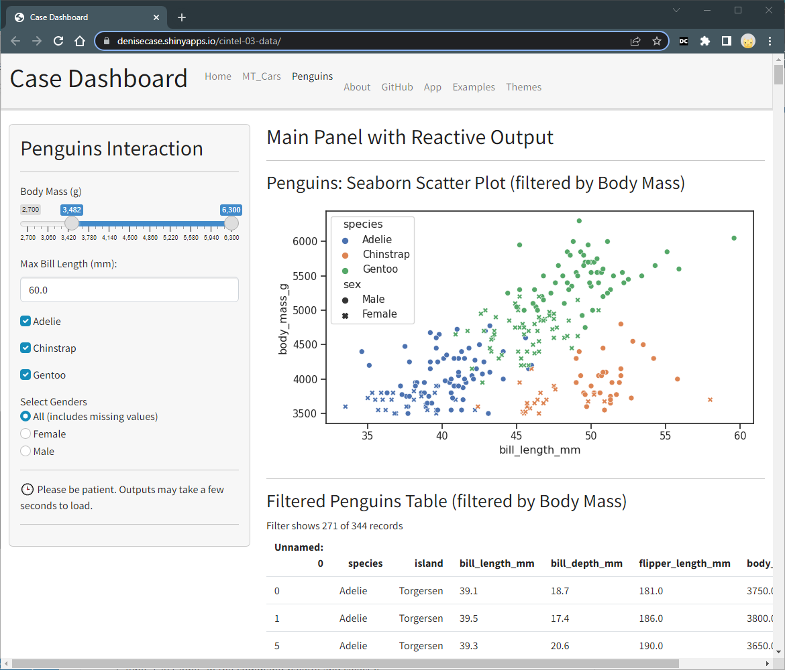

# Continuous Intelligence and Interactive Analytics - Working With Data

- Interactive app: [cintel-03-data](https://denisecase.shinyapps.io/cintel-03-data/) - see MT Cars tab and Penguins tab
- Repository: [cintel-03-data](https://github.com/denisecase/cintel-03-data)
- Author: [Denise Case](https://github.com/denisecase)

This time, we add data. 
Two very common types of data are Excel data and CSV (comma-separated values) data.
Python has libraries to read and write both types of data - and more.

We need to understand data before using it.
What columns are included? What data types are used?
Are there any missing values? Are there any outliers?
Dates can be challenging and may need to be converted to a standard format for processing.

Inspect the data first. 
CSV files are easy to open in VS Code.
Excel files are easy to open in Excel.

We'll work with two datasets:

- [Penguins](https://education.rstudio.com/blog/2020/07/palmerpenguins-cran/)
- [MT Cars](https://shinylive.io/py/examples/#read-local-csv) [learn more](https://www.stat.ubc.ca/~gavin/STEPIBookNewStyle/course/num/Day3/Session3.2.pdf)

-----

## Copy This Repository

Copy this starter repository into your own GitHub account by clicking the 'Fork' button at the top of this page. 

## Get the Code to your Local Machine
    
1. Open VS Code and from the menu, select **View** / **Command Palette**.
1. Type "Git: Clone" in the command palette and select it.
1. Enter the URL (web address) of your forked GitHub repository (make sure it contains your GitHub username - not denisecase).
1. Choose a directory on your local machine (e.g., Documents folder) to store the project.
1. If prompted, sign in to GitHub from VS Code.

## Make Changes in VS Code

With your repository folder open in VS Code:

1. Click on this README.md file for editing.
1. Update the README.md file by changing your name in the author link above.
1. Update the links in the README.md file to your username instead of denisecase.

## Save Your Changes

1. After making changes, you want to send them back to GitHub.
1. In VS Code, find the "Source Control" icon and click it.
1. Important: Enter a brief commit message describing your changes.
1. Change the "Commit" button dropdown to "Commit and Push" to send your changes back to GitHub.

## Run and Deploy the Example App

Before making any changes to the code, run the example app and deploy it to shinyapps.io like we did before. 

1. Read [SHINY.md](SHINY.md) to create and deploy the example app. 
1. Review the folders and files in this repo. 
1. Compare them to earlier projects.
1. Notice what changed and what remains constant. 

The consistent parts are 'boilerplate'.
We use boilerplate code a lot. To be productive quickly, focus on the parts that change.

Don't be concerned by the large number of files. Each has a relatively small, specific purpose.
Data analysts often use standard ways of organizing their work. 

🚀 Rocket Tip: Check out [Cookiecutter Data Science](https://drivendata.github.io/cookiecutter-data-science/#directory-structure) - one of many cookie cutter templates recommending reusable project structures.

-----

## Illustration

To see the app running locally, see the [screencast](https://app.screencast.com/JeHKkjIA8bUXp).
